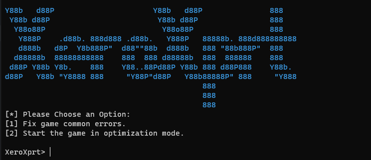

# XeroXprt



XeroXprt is a utility tool designed to assist users with fixing common errors encountered while opening Xero. It provides options to resolve client/launcher errors and optimize network settings to solve network related problems and enhancing experience.

## Features

- Fix common game/client errors.
- Start the game in optimization mode.

## Prerequisites

- Python 3.x installed.
- Required Python packages installed (`colorama`).
- Windows operating system.

## Installation

1. Clone or download this repository to your local machine.
2. Install the required Python packages using pip:

```bash
pip install -r requirements.txt
```

## Usage

1. Navigate to the directory where you have downloaded or cloned this repository.
2. Run the `xeroxprt.py` file using Python:

```bash
python xeroxprt.py
```

3. Follow the on-screen instructions to choose an option.

## Description

XeroXprt is a Python-based utility tool developed to streamline the process of resolving common errors faced by players while launching Xero. It offers two primary functionalities:

1. **Fixing Common Errors**: XeroXprt provides a guided approach to fixing common game/client errors encountered during the launch of Xero. It checks for the user's Windows version, installs necessary VCRedists, configures DNS servers, and adjusts registry settings to optimize network performance.

2. **Optimization Mode**: Users can start the game in optimization mode, which applies various network optimizations to enhance gaming performance. This includes adjusting firewall rules, modifying registry settings, and enabling certain network features.

## Antivirus Warning

Some antivirus programs may flag the `all.bat` file as potentially harmful due to the nature of the optimizations it performs. However, rest assured that the `all.bat` file is safe to use. If your antivirus software raises a warning, consider temporarily disabling it while using XeroXprt.

## Additional Files

### `start.bat`

The `start.bat` file is used to start the game with certain parameters. The command `start xero.exe -d3d9ex` is executed to start the game with DirectX 9Ex enabled.

### `all.bat`

The `all.bat` file contains a series of commands to optimize network settings for improved gaming performance. It releases and renews IP configurations, flushes DNS, modifies registry settings, and adjusts firewall rules, among other optimizations.

## Version

- Current version: 1.0.0

## License

XeroXprt is licensed under the [MIT License](LICENSE).

## Contributors

- [@Jizen0x01](https://github.com/Jizen0x01): Developer of XeroXprt

Feel free to contribute by submitting bug reports, feature requests, or pull requests.
might convert it to C++/C#
```
